- [Adjust live processing DaVis-MATLAB interface](#adjust-live-processing-davis-matlab-interface)
- [Adjust looping measurement DaVis-MATLAB interface](#adjust-looping-measurement-davis-matlab-interface)
- [PIV postprocessing settings](#piv-postprocessing-settings)
- [Looping measurement settings](#looping-measurement-settings)

### Adjust live processing DaVis-MATLAB interface
1. Launch `DaVis` and go to `Recording`
    
    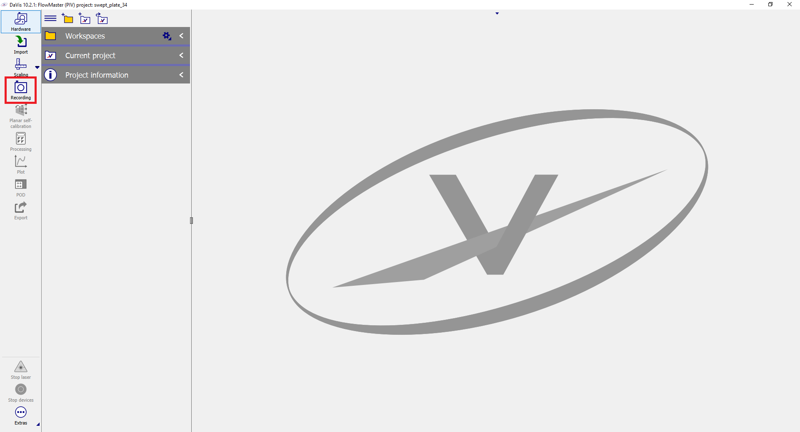
2. Select `Aria of Intereset`
    
    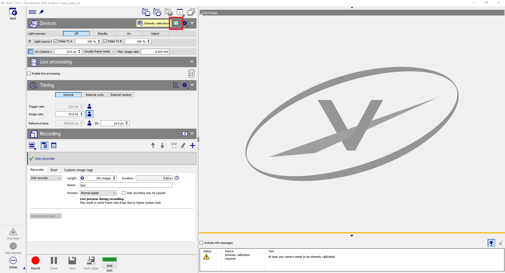
3. Config crop frame and accept changes
    
    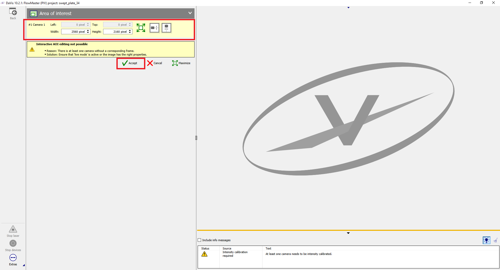
4. Enable `live processing`
    
    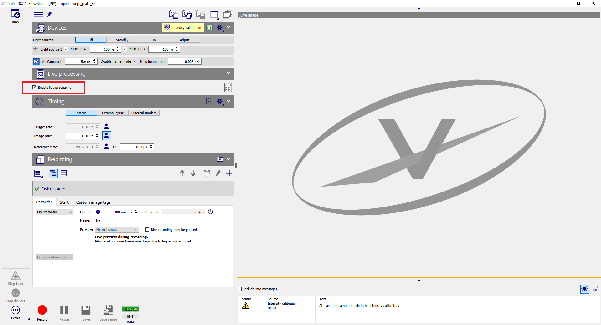
5. Enable `live view`
    
    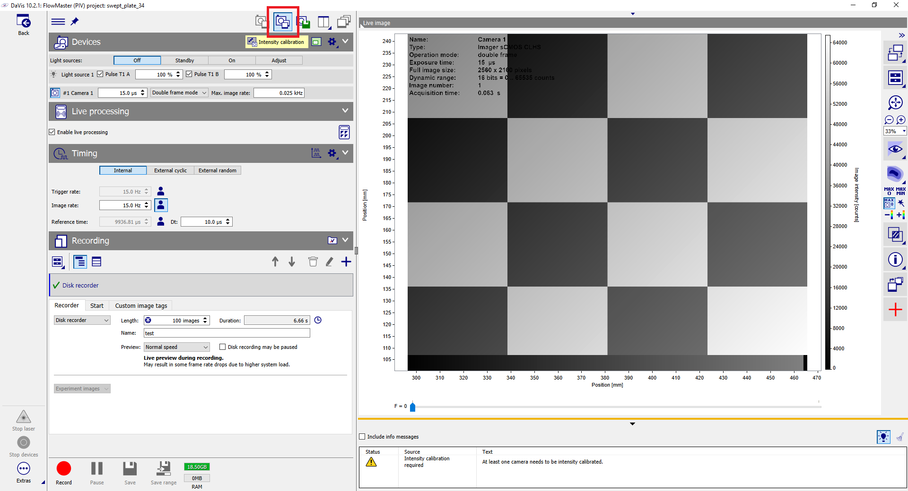
6. Go to `configure processing`
    
    
7. Import `operation list` located in `./macros/2DPIV-LIVE-MATLAB.OperationList.lvs`
    
    
8. Adjust PIV settings
    
    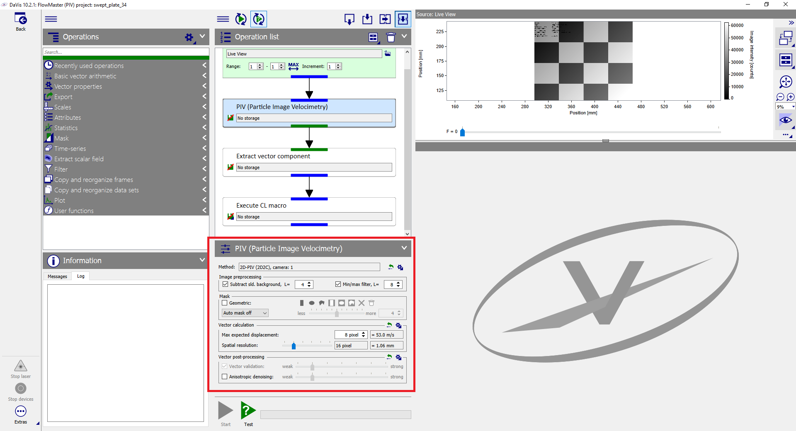
9. Configure script:
   1. Redefine `dll_name` varibale by absolute path of `libs\sock\sock_cl.dll`
   2. Redefine `parsInt` and `parsString` variables by actual MATLAB TCP server port and address

   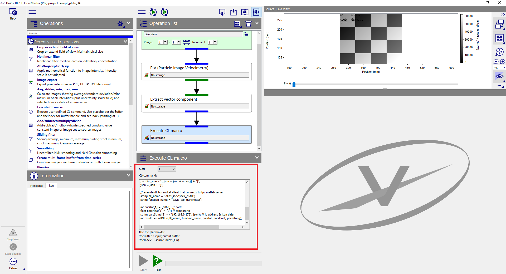 
10. Return to `Recording` and enable `live view`
11. Go to MATLAB application and adjust postprocessing ([see more](#piv-postprocessing-settings))

    

### Adjust looping measurement DaVis-MATLAB interface
1. Launch `DaVis` and go to `Recording` 
    
    
2. Import `setting list` located in `macros\PIV-LOOP-MATLAB.Recording.lvs` 
    
    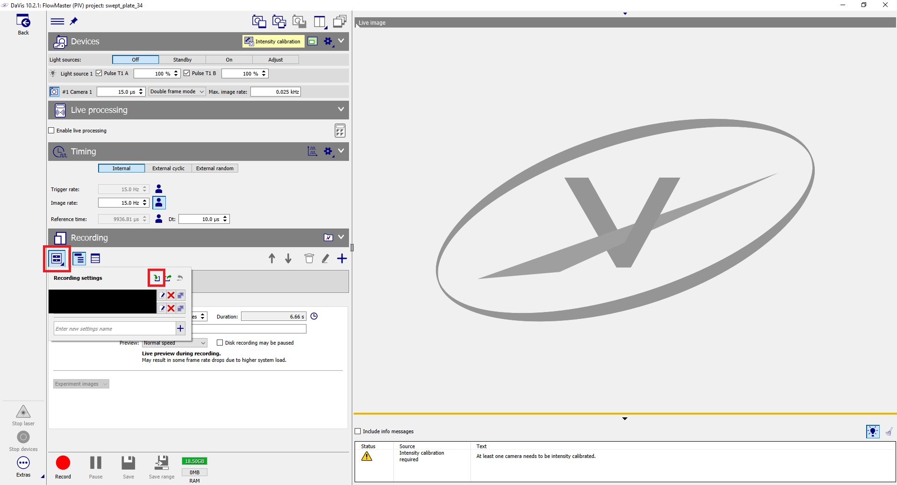
3. Configure script:
   1. Redefine `dll_name` varibale by absolute path of `libs\sock\sock_cl.dll`
   2. Redefine `parsInt` and `parsString` variables by actual MATLAB TCP server port and address

   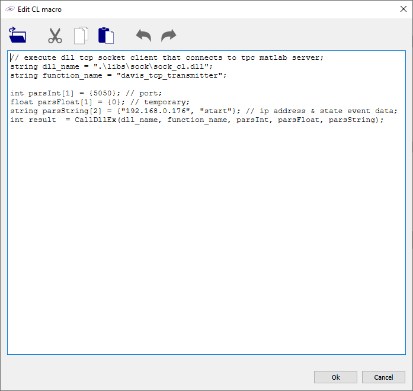
4. Adjust measurements parameters
    
    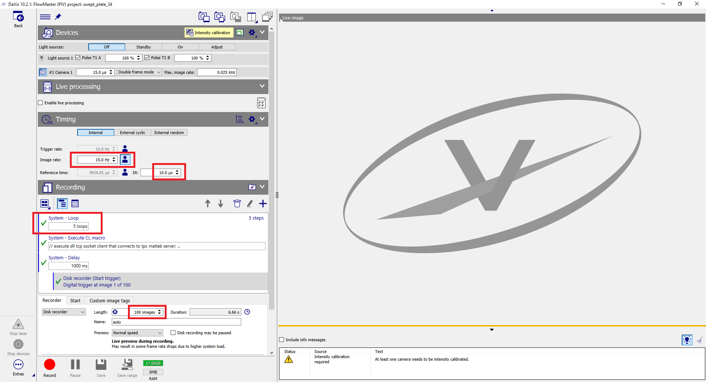
5. Go to MATLAB application, switch to `MES` tab and configure measurement grid ([see more](#looping-measurement-settings)) then click to `Start` button
    
    

6. Go to DaVis and click `Recording` button
   
   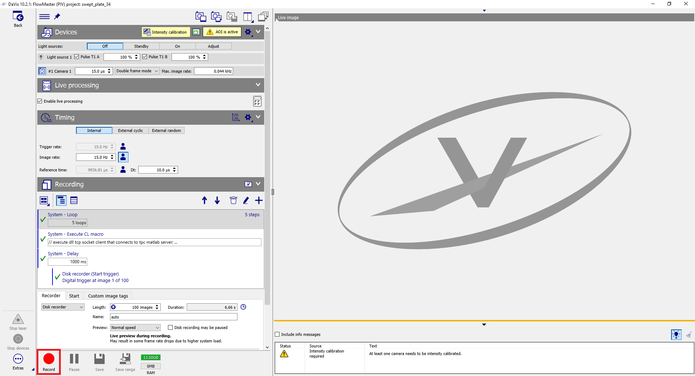

### PIV postprocessing settings

| name        | description                                                                   |
| :---------- | :---------------------------------------------------------------------------- |
| port        | MATLAB TCP server port                                                        |
| statistics  | measurement count                                                             |
| fill        | fill missing value algorithm applying to instantaneous data                   |
| spatfilt    | spatial filter applying to time averaged data                                 |
| spatfiltker | kernel size of `spatfilt` transform                                           |
| shift       | perform transversal pixel shifting of 2D data before longitudinal averaging   |
| shiftker    | kernel of `shift` transform: `[left upper corner, right upper corner, width]` |
| subtrend    | subtract trend from 1D data                                                   |
| tukerwin    | weight 1D data by window function                                             |

### Looping measurement settings

| name       | description                                                                         |
| :--------- | :---------------------------------------------------------------------------------- |
| port       | MATLAB TCP server port                                                              |
| index      | channel of actuator position                                                        |
| voltage    | voltage vector                                                                      |
| position   | step motors position vector                                                         |
| amplitude  | voltage vector to assign same amplitude for all channels                            |
| seeding    | apply flow seeding during measurement                                               |
| triggerpin | external trigger pin of MCU board to synchronize DaVis recording                    |
| grid       | scan table building mode:  1. manual 2. generator                             |
| mode       | measurement mode: 1. extsync - DaVis store data 2. matlab - MATLAB store data |